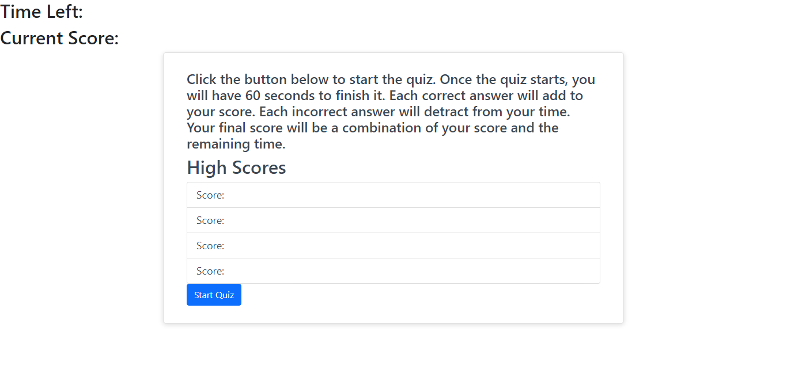
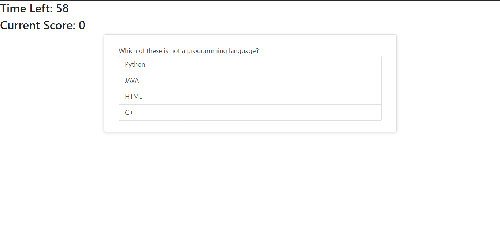
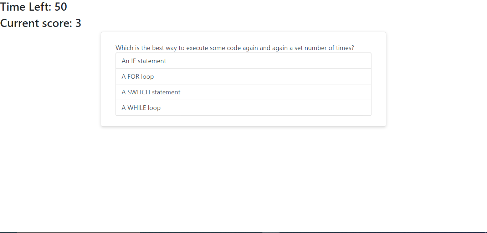
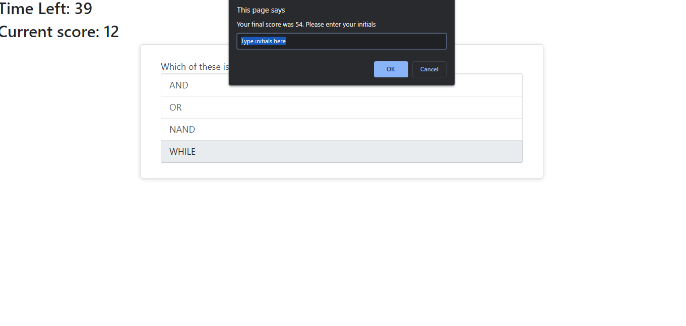
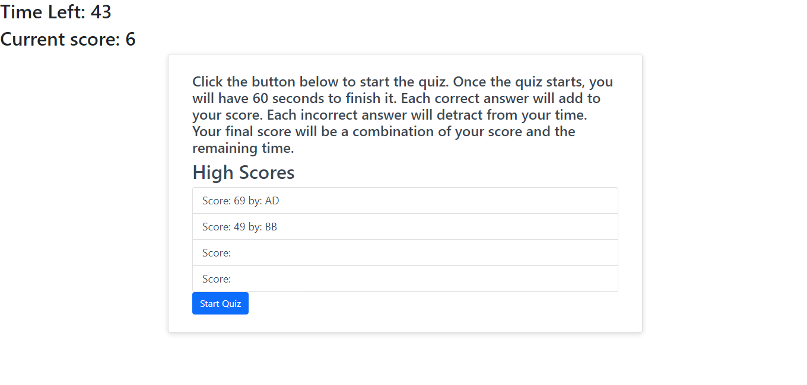
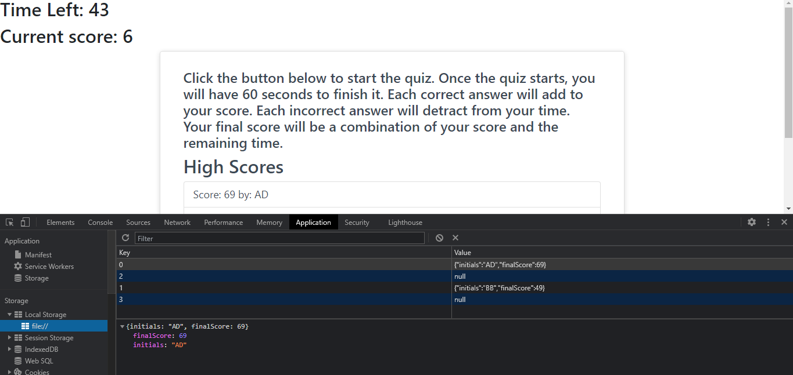

# Code-Quiz

Bootcamp Week 4 Homework

This application quizes the user on computer knowledge and stores their score in the browser memory.

## Installation
Simply go to https://acdecastro.github.io/Code-Quiz/ .

The code for this project can be viewed at https://github.com/ACDecastro/Code-Quiz .

## Technologies Used
> Javascript
> HTML
> Bootstrap

## Usage
After opening the webpage, click on the "Start Quiz" button.

Answer the questions to the best of your ability. Click on a choice to answer a question.

Answering a question correctly will add to your score. Answering incorrectly will detract from your time.

The quiz ends when time runs out or you have answered all the questions. When the quiz ends, you will be prompted to enter your initials.

After clicking OK, your initials and score for that attempt will be saved and you will be brought to the home screen where you can view your top 5 high scores. 

Your scores can also be seen using developer tools under the application tab.

